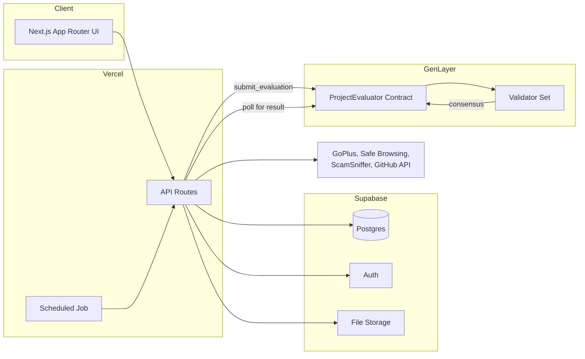
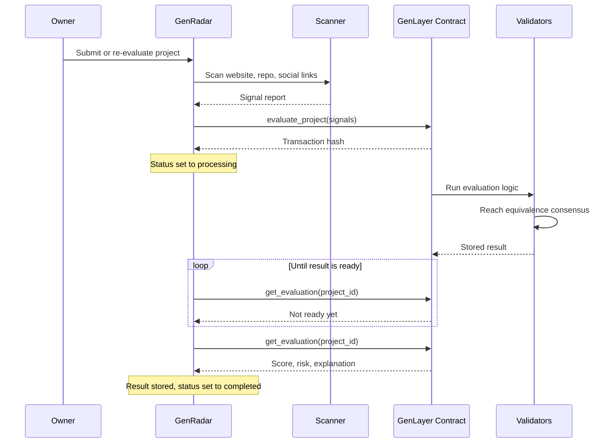

# GenRadar

GenRadar is a discovery and trust layer for projects built on the GenLayer network. It combines automated security scanning, decentralized AI evaluation through GenLayer Intelligent Contracts, and community feedback into a single transparent score, so that builders can be discovered and users can assess risk before they interact with a project.

GenRadar does not generate its own opinion of a project. It collects objective signals, submits them to GenLayer for independent validator consensus, and displays exactly what comes back. No score is ever shown unless GenLayer has actually produced one.

## Table of Contents

1. Overview
2. Core Principles
3. System Architecture
4. The Evaluation Pipeline
5. The GenLayer Intelligent Contract
6. Data Model
7. Security Model
8. Application Structure
9. Technology Stack
10. Environment Configuration
11. Local Development
12. Deployment
13. Roadmap

## 1. Overview

A builder submits a project through GenRadar with a name, description, and a set of public links such as a website, GitHub repository, documentation, and social channels. GenRadar then runs an automated scan of those links, sends the resulting signals to a GenLayer Intelligent Contract, and waits for a panel of independent validators to reach consensus on a security score, a transparency score, and a written explanation. Once consensus is reached, the result is stored and surfaced across the platform, including a public project page, a directory of all evaluated projects, and a builder profile system.

Alongside the AI evaluation, the community can upvote or downvote a project, leave star ratings and written feedback, save projects to a personal list, and report suspicious behavior. None of this community activity influences the AI evaluation itself. The two signals are presented side by side so a reader can judge for themselves how much weight to give each one.

## 2. Core Principles

GenRadar is built around a small number of principles that shape almost every architectural decision in the codebase.

**GenLayer is the only source of a score.** The application never computes or substitutes its own score. If a transaction to the Intelligent Contract fails, or if validator consensus has not yet been reached, the interface continues to display an evaluating state rather than inventing a placeholder result. A score only ever appears on screen once it has genuinely come back from the chain.

**Evaluation is asynchronous by design.** Reaching consensus among multiple independent validators running large language model inference takes meaningfully longer than a typical web request. Rather than holding a connection open and blocking on that wait, GenRadar splits evaluation into a fast submission step and a separate, repeatable check step. This keeps every request well within normal serverless execution limits and makes the system resilient to slow or temporarily unavailable validators.

**Every public write path is authenticated and scoped to its owner.** Row level security in the database enforces that a user can only modify their own data. Administrative actions run under a service role that bypasses row level security entirely, and are themselves gated by an explicit allowlist checked on the server for every request.

**The frontend never quietly displays stale data.** Wherever an evaluation can change in the background, independent of the page currently open, that page actively polls for the current truth rather than trusting whatever was true at the moment it first loaded.

## 3. System Architecture

At a high level, GenRadar consists of a Next.js application, a Postgres database managed through Supabase, and a GenLayer Intelligent Contract that performs the actual evaluation.



The Next.js application is responsible for everything a visitor sees and for every write to the database. It runs entirely on Vercel as a set of serverless functions, with no separate backend service. Supabase provides the relational database, authentication, and object storage for project logos and avatars. GenLayer provides the actual evaluation logic, executed by an independent set of validators rather than by GenRadar's own infrastructure.

## 4. The Evaluation Pipeline

This is the part of the system most directly tied to GenLayer, and the part where correctness matters most.

### Step one, submission

When a project is submitted, or when a re-evaluation is requested by its owner or by an administrator, GenRadar runs a scan of the project's public links. The scanner checks the website against GoPlus, Google Safe Browsing, and the ScamSniffer phishing list, inspects the page for obfuscated scripts, hidden redirects, and wallet drainer patterns, verifies SSL configuration, and checks whether a GitHub repository, documentation site, and social channels are present and reachable. The result of this scan is a structured object of signals, for example whether phishing patterns were detected, whether the wallet interaction looks unsafe, and whether a GitHub repository exists.

These signals, along with the project's own description, are sent to the GenLayer Intelligent Contract through a single write transaction. This step typically completes in a few seconds and does not wait for any result. The transaction hash and the raw signals themselves are stored immediately, so that what was actually scanned and submitted is always available for review, independent of how long consensus takes afterward.

### Step two, consensus

Once the transaction is accepted, GenLayer routes it to a panel of independent validators. Each validator runs the contract logic, which computes deterministic security and transparency scores from the submitted signals and separately asks a large language model to produce a short, human readable explanation of the result. GenLayer's equivalence principle then checks that the validators' language model outputs agree closely enough in meaning to be accepted as a single consensus result, even though no two validators will produce identical text. This is what allows the explanation to be genuinely AI generated while still being verifiable rather than coming from a single, unaccountable model call.

### Step three, polling for the result

GenRadar does not keep a connection open while consensus is reached. Instead, any subsequent request that touches a project currently being evaluated, for example loading its page, viewing the project directory, or opening the administrative panel, performs one fast read against the contract to check whether a result is now available. This check is rate limited per project so that high traffic does not result in excessive reads against the chain. A scheduled job runs as a background safety net, checking on any project that has not been viewed by anyone since it started evaluating.

The moment a real result is available, it is written to the database exactly once, and the project's status moves from processing to completed. If consensus cannot be reached within a generous timeout, the project is marked as failed with a stored error message, and no result is ever fabricated in its place. An administrator or the project's owner can always trigger a fresh attempt.



## 5. The GenLayer Intelligent Contract

The contract lives in the repository as a single Python file and exposes two methods. The write method, evaluate_project, accepts the project's details and its scanner signals, computes a security score and a transparency score using fixed, auditable rules, and separately asks the underlying language model for a short explanation of the result through GenLayer's non deterministic execution primitive. The read method, get_evaluation, returns the stored result for a given project, and returns nothing if evaluation has not yet completed.

Because the scoring rules themselves are deterministic and run identically on every validator, what actually requires consensus is the natural language explanation. GenLayer's comparative equivalence principle is used specifically for this part, allowing validators to agree that several different pieces of generated text convey the same substantive judgment without requiring them to be character for character identical.

## 6. Data Model

The core of the schema is the projects table, which stores a project's public details, its current public link set, and its evaluation lifecycle state. Evaluation lifecycle state is intentionally kept on the project row itself, separate from the eventual result, so that a project can be in a clearly defined pending, processing, completed, or failed state at any time, with an associated transaction hash and error message where relevant.

The ai_scores table stores one row per completed evaluation, including the numeric score, the risk classification, the lists of positive signals and risk findings, the full written explanation, the on chain transaction hash, and the exact scanner signals that produced that particular result. Because a project may be evaluated more than once over its lifetime, this table is intentionally append only, with the application always reading the most recent row.

Supporting tables cover votes, star ratings, comments, saved and viewed and reported interactions, builder profiles, and custom categories suggested by builders during submission. Every table that accepts a write from an ordinary user has row level security enabled, scoped to that user's own identity.

## 7. Security Model

Row level security is the primary access control mechanism at the database layer. Public read access is granted only to projects with an active status, and only a project's owner may update or delete it. Administrative routes use a service role key that bypasses row level security entirely, but every administrative route independently verifies the caller's identity against an explicit allowlist of administrator email addresses before performing any privileged action, so database level permissions and application level permissions are enforced separately and do not rely on each other.

Re-evaluation may be triggered by a project's owner or by an administrator, and this is checked on the server using the caller's authenticated session rather than trusted from the client. Submission is rate limited per user. Categories suggested by builders during submission require an authenticated session before being written. A builder profile may only be created once its owner has at least one active project, both in the interface and as an independent check on the server.

## 8. Application Structure

```
app/
  page.tsx                  Home page, including the live AI evaluator demonstration
  explore/                  Public directory of all evaluated projects
  submit/                   Project submission form
  project/[id]/             Individual project page, including AI evaluation detail
  profile/                  Authenticated user dashboard and builder profile editor
  builders/                 Builder directory and leaderboard
  admin/                    Administrative panel
  api/                      All server side routes and write paths

lib/
  genlayerAI.ts             Submission and polling against the GenLayer contract
  runEvaluation.ts          Shared evaluation orchestration used by every entry point
  scanner.ts                Website and repository security scanning
  validation.ts             Input validation schemas
  rateLimit.ts              Per user request throttling

contracts/
  project_evaluator.py      The GenLayer Intelligent Contract

components/
  ProjectCard.tsx           Project summary card with live evaluation status
  ProjectScorePanel.tsx     Detailed score panel shown on a project page
  AIEvaluationPanel.tsx     Full evaluation breakdown and explanation
  BuilderProfile.tsx        Public builder identity and project history

supabase/
  schema.sql                Base schema
  migration_*.sql           Incremental, idempotent migrations
```

## 9. Technology Stack

| Layer | Choice |
|---|---|
| Frontend framework | Next.js 14, App Router, React 18, TypeScript |
| Styling | Tailwind CSS and component level styling |
| Database | Postgres, managed through Supabase |
| Authentication | Supabase Auth |
| File storage | Supabase Storage, for logos and avatars |
| Decentralized evaluation | GenLayer Intelligent Contracts, accessed through genlayer js |
| Hosting | Vercel, serverless functions throughout |
| External security checks | GoPlus, Google Safe Browsing, ScamSniffer |

## 10. Environment Configuration

The following environment variables are required. Values used locally in a development environment must also be configured separately in the hosting provider's dashboard for production, since local environment files are never deployed.

| Variable | Purpose |
|---|---|
| NEXT_PUBLIC_SUPABASE_URL | Supabase project URL |
| NEXT_PUBLIC_SUPABASE_ANON_KEY | Public Supabase key, subject to row level security |
| SUPABASE_SERVICE_ROLE_KEY | Privileged Supabase key, used only in server side administrative and evaluation code |
| GENLAYER_CONTRACT_ADDRESS | Deployed address of the ProjectEvaluator contract |
| GENLAYER_PRIVATE_KEY | Wallet used to submit evaluation transactions |
| GENLAYER_NETWORK | Target GenLayer network, for example studionet |
| CRON_SECRET | Shared secret authenticating the scheduled background job |
| GOOGLE_SAFE_BROWSING_KEY | API key for the Safe Browsing check performed by the scanner |

## 11. Local Development

```bash
npm install
cp .env.example .env.local
# fill in .env.local with real values
npm run dev
```

To deploy a fresh copy of the Intelligent Contract to GenLayer, ensure the wallet referenced by GENLAYER_PRIVATE_KEY holds testnet tokens for the configured network, then run:

```bash
npm run contract:deploy
```

This writes the resulting contract address back into the local environment file automatically. The same address must also be set in the hosting provider's environment configuration before deploying.

## 12. Deployment

The application deploys to Vercel directly from its git repository. The scheduled background job is configured through the crons entry in vercel.json and authenticated using the CRON_SECRET environment variable. Database migrations are plain SQL files intended to be run once, in order, through the Supabase SQL editor, and are written to be safe to run more than once.

## 13. Roadmap

Planned improvements include a push based notification from GenLayer back to GenRadar when consensus is reached, removing the remaining dependence on polling, expansion of the scanner to cover additional on chain risk signals, and a public API allowing third parties to query a project's evaluation programmatically.
